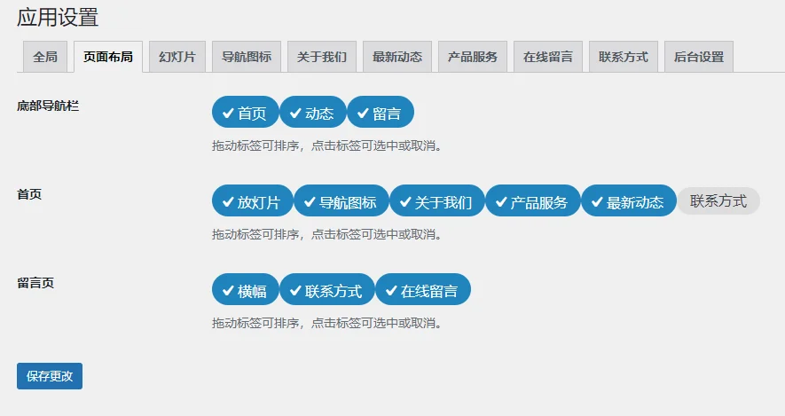
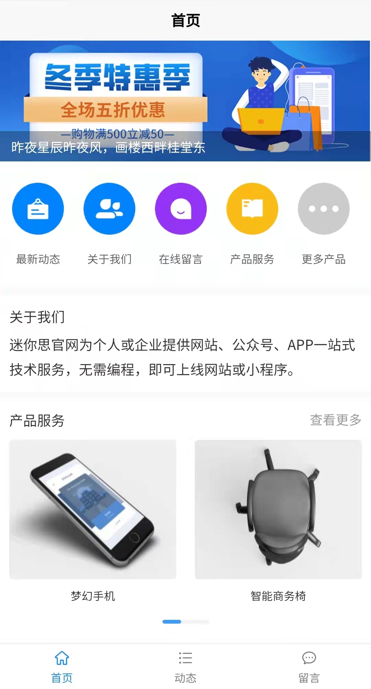

# 企业官网模板（UNIAPP + UView 2.0 + WordPress REST API）

这是一个基于 **UNIAPP + UView 2.0**
开发的**开源免费企业官网模板**，适用于 **企业官网、微信小程序、H5
页面、App** 等多端场景。\
后端采用 **WordPress** 作为内容管理系统，通过 **REST API**
与前端通信，实现灵活、可配置的内容管理。

------------------------------------------------------------------------

## ✨ 特性亮点

-   🚀 使用 UNIAPP 开发，一套代码多端运行（H5 / 微信小程序 /
    支付宝小程序 / 百度小程序 / App）
-   🎨 基于 UView 2.0 组件库，风格统一、轻量优雅
-   🔌 WordPress 插件作为后端，提供丰富配置页面
-   🔗 自动注册 REST API（如：`/wp-json/ow/v1/settings`）
-   ⚙️ 后台可配置首页模块、联系方式，无需修改代码
-   🆓 前端模板完全开源（MIT）

------------------------------------------------------------------------

## 🔗 演示地址

👉 **H5 Demo**：\
https://demo.xenice.com/h5/ow/#/

👉 **后端下载**：\
https://github.com/xenice/minisi-ow

------------------------------------------------------------------------

## 📦 下载地址

### **前端模板（UNIAPP 项目）**

-   👉 GitHub 下载（本仓库源代码）
-   或通过 **HBuilderX 插件市场**搜索 **"企业官网模板"** 一键导入

### **后端插件（WordPress 插件）**

-   👉 插件下载 [前往下载](https://github.com/xenice/minisi-ow)
-   下载 ZIP 后，在 **WordPress → 插件 → 安装插件 → 上传插件** 启用即可

------------------------------------------------------------------------

## 🛠 使用方法

### 1. 后端部署（WordPress）


1.  将下载的 WordPress 插件 ZIP 上传至你的 WordPress 站点\
    **插件 → 安装插件 → 上传插件**
2.  启用插件后，进入：\
    **设置 → 应用**
3.  可自定义内容包括：
    -   网站基本信息（Logo / 标题 / 联系方式）
    -   首页模块开关（轮播图 / 服务 / 案例展示等）
    -   社交链接

插件会自动注册 REST API 供前端使用，例如：

    /wp-json/ow/v1/settings



------------------------------------------------------------------------

### 2. 前端配置（UNIAPP）

1.  从 GitHub 或 插件市场 导入项目到 **HBuilderX**
2.  打开项目根目录下 **App.vue**
3.  修改服务器地址：

``` javascript
globalData: {
  server: 'https://www.yourdomain.com/', // ← 替换为你的 WordPress 站点地址
},
```

4.  编译运行（H5 / 微信小程序 / App）




------------------------------------------------------------------------

## 🌐 兼容性说明

前端技术基于 **UView 2.0**，官方支持：

-   H5
-   微信小程序
-   支付宝小程序
-   百度小程序
-   App（Vue2）

目前已在 **Chrome 浏览器（H5）** 中完成主要测试。\
其他平台若出现个别样式差异，可根据平台差异微调 `rpx` 或使用条件编译。

------------------------------------------------------------------------

## 📚 开源协议

本项目采用 **MIT License**，可免费用于个人及商业用途。\
欢迎 Star ⭐ 和 Fork 🍴！

------------------------------------------------------------------------

## 📨 技术支持 & 反馈

如需技术支持、功能建议、Bug 反馈，请提交 Issue 或联系作者。
